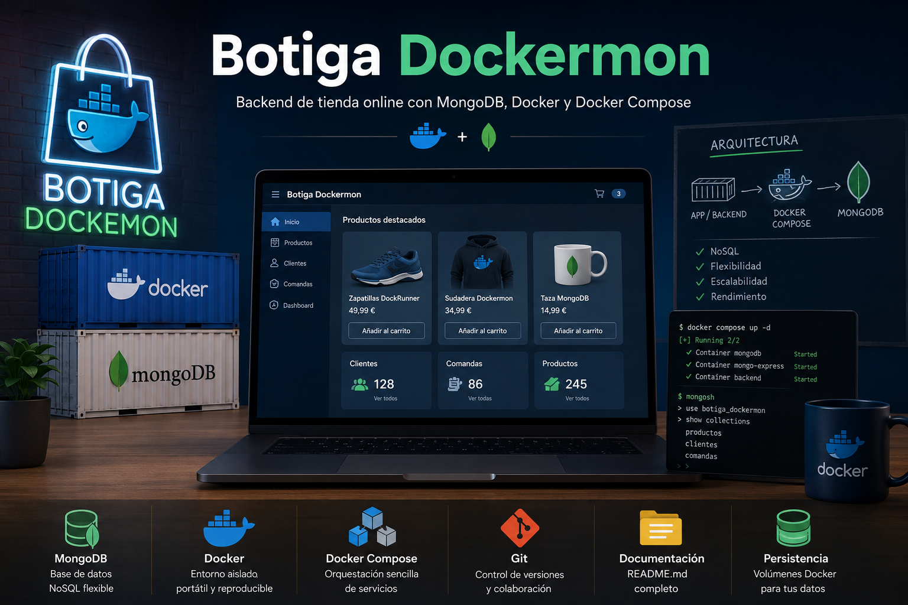

# Botiga Dockermon

## Resumen del proyecto

El proyecto consiste en **diseñar e implementar el backend de una tienda online** utilizando una base de datos **NoSQL** (**MongoDB**) ejecutada dentro de un contenedor **Docker** orquestado con **Docker Compose**. Se simula un entorno real donde los datos de productos, clientes y pedidos se almacenan y gestionan de forma no relacional.

El núcleo del proyecto es **crear una estructura de base de datos funcional y persistente**, accesible tanto mediante comandos directos como a través de una interfaz web (Mongo Express). Se definen modelos de datos para tres colecciones principales (productos, clientes y comandas), decidiendo en cada caso si usar embedding o referencias según el comportamiento esperado de los datos.

Además, se incorporan buenas prácticas de desarrollo profesional: uso de **control de versiones**  (**Git**), documentación técnica completa (Software Design Document) (**README.md**), persistencia mediante volúmenes Docker, y orquestación de servicios con **Docker Compose**.

El proyecto no es solo una serie de ejercicios sueltos, sino **un sistema completo y reproducible** que cualquier desarrollador podría levantar en su máquina para estudiar o extender, demostrando competencias clave en bases de datos NoSQL, contenedores y optimización de consultas con índices.

## Prerrequisitos

| Requisito                   | Versión mínima            | Comprobación             | Implementado      |

| --------------------------- | ------------------------- | ------------------------ | ----------------- |

| WSL                         | 2.0                       | `wsl --list --verbose`   | Debian 13 (WSL 2) |

| Docker                      | 20.10 o superior          | `docker --version`       | 29.4.3            |

| Docker Compose              | V2 (integrados en Docker) | `docker compose version` | v5.1.3            |

| Git                         | 2.20 o superior           | `git --version`          | 2.47.3            |

| Navegador web               | actualizado               |                          |                   |

| Editor de código (opcional) | VS Code, etc.             | `code --version`         | VSCode 1.117.0    |

---

## Análisis transaccional sobre el stack tecnológico del proyecto

MongoDB nos aporta un sistema de almacenamiento **flexible y sin esquema fijo**, lo que significa que podemos añadir campos a los documentos de productos, clientes o pedidos sin necesidad de ejecutar costosas y complejas migraciones. Cada pedido puede tener una estructura ligeramente diferente según su estado o tipo de pago, algo muy útil en un entorno de comercio electrónico cambiante.

Por otro lado, a diferencia de una base de datos SQL tradicional (como PostgreSQL o MySQL), MongoDB **no ofrece integridad referencial automática** (no hay claves foráneas que relacionen tablas), y las transacciones multi-colección son más limitadas y con mayor overhead. En una tienda online SQL, si eliminamos un cliente, la base de datos podría rechazar la operación si tiene pedidos asociados; en MongoDB, esa lógica debemos implementarla explícitamente en nuestra aplicación.

En cuanto a la "dockerización": nos permite empaquetar toda la pila tecnológica (backend + MongoDB) en contenedores portátiles y reproducibles, garantizando que el entorno de desarrollo, **pruebas y producción sea idéntico**. El compromiso aquí es un mínimo overhead de rendimiento y la necesidad de **gestionar volúmenes** de forma consciente para no perder datos al recrear contenedores.

Esta combinación (Docker + MongoDB) es ideal para entornos de desarrollo ágil y prototipado rápido, aunque en producción a gran escala requeriría configuraciones adicionales como clústeres de MongoDB y orquestadores más potentes como Kubernetes.



## Software Design Document (SDD)

**Checklist del Proyecto**

- [x] **Configuración del SCV (GitHub)**

- [x] **Creación de la estructura de carpetas en WSL**

- [ ] **Instrucciones de instalación y puesta en marcha**

- [ ] **Estructura de ficheros**

- [ ] **Comandos principales para operar el entorno (como hacer consultas y crear datos)**

- [ ] **Explicación de los volúmenes i redes configuradas**

- [ ] **Instalación y configuración de Docker y Compose**

### 

### Bloque 0

#### Configuracion del SCV en la nube

La configuración del Sistema de Control de Versiones (GitHub) al inicio es una buena práctica, ya que permite establecer una **línea base** del proyecto, garantizar la **trazabilidad de los cambios** (histórico) y facilitar la **colaboración** desde el inicio del desarrollo.

Para poder utilizar Git, es necesario instalarlo en el sistema y configurarlo con el nombre de usuario y correo electrónico correspondiente.

```bash
# Antes de instalar Git, comprobaremos si ya lo tenemos instalado
git --version

# Comando de instalacion de Git
sudo apt update # -> Actualizamos el repositorio apt
sudo apt install git

# Una vez comprobada la instalacion de Git, crearemos un repositorio en la nube (GitHub)
# y lo clonaremos en nuestro Git local.

sudo git clone https://github.com/<usuario>/<nombre_del_repositorio>
```


#### Creación de la estructura de carpetas en WSL

Crearemos la siguiente estructura de carpetas para albergar nuestro proyecto.

```
practica-mongodb/
├── docker-compose.yml # Definició dels serveis
├── mongo-init/
│ └── init.js # Script d'inicialització
├── queries/
│ ├── crud.js # Operacions CRUD
│ └── advanced.js # Consultes avançades
├── data/ # Volum de dades (auto-generat)
└── README.md # Documentació del projecte
```

Podemos utilizar el siguiente script:

```bash
#!/bin/bash

# Nombre del directorio principal
MAIN_DIR="practica-mongodb"

echo "Creando estructura de carpetas para: ${MAIN_DIR}"

# Crear directorio principal
mkdir -p "$MAIN_DIR"

# Crear subdirectorios
mkdir -p "$MAIN_DIR/mongo-init"
mkdir -p "$MAIN_DIR/queries"
mkdir -p "$MAIN_DIR/data"

# Crear archivos vacíos
touch "$MAIN_DIR/docker-compose.yml"
touch "$MAIN_DIR/mongo-init/init.js"
touch "$MAIN_DIR/queries/crud.js"
touch "$MAIN_DIR/queries/advanced.js"
touch "$MAIN_DIR/README.md"

echo "Estructura creada correctamente:"
echo "practica-mongodb/"
echo "├── docker-compose.yml"
echo "├── mongo-init/"
echo "│   └── init.js"
echo "├── queries/"
echo "│   ├── crud.js"
echo "│   └── advanced.js"
echo "├── data/"
echo "└── README.md"
```


Podemos ejecutarlo con:

```bash
chmod +x crear_estructura.sh #-> Asignar permisos de ejecución
./crear_estructura.sh
```

### Bloque 1

#### Instrucciones de instalación y puesta en marcha

**Consideraciones previas**

El servicio MongoDB requiere usuario y contraseña y es buena práctica de seguridad no incluir en el código fuente, los usuarios y contraseñas. Docker proporciona una solución para dicho problema al construir los contenedores rearemos el archivo `.env`

##### MongoDB

El servicio MongoDB requiere usuario y contraseña y es buena práctica de seguridad no incluirlos. Docker proporciona una solución para dicho problema al construir los contenedores mediante el archivo `.env`.

Este archivo contiene las variables de entorno sensibles que serán **inyectadas en los contenedores en tiempo de ejecución**, sin necesidad de hardcodearlas en el `docker-compose.yml` o en los scripts de inicialización.

Este archivo `.env` es detectado por docker compose automaticamente si ambos archivos se encuentran en la misma carpeta

En nuestro caso:

```bash
MONGO_USER=admin
MONGO_PASSWORD=admin1234
```

Para evitar que el archivo `.env` sea subido al repositorio, y por lo tanto accesible, lo añadiremos al `.gitignore`

```bash
git push --force origin <nombre-de-la-rama>
```

```

```