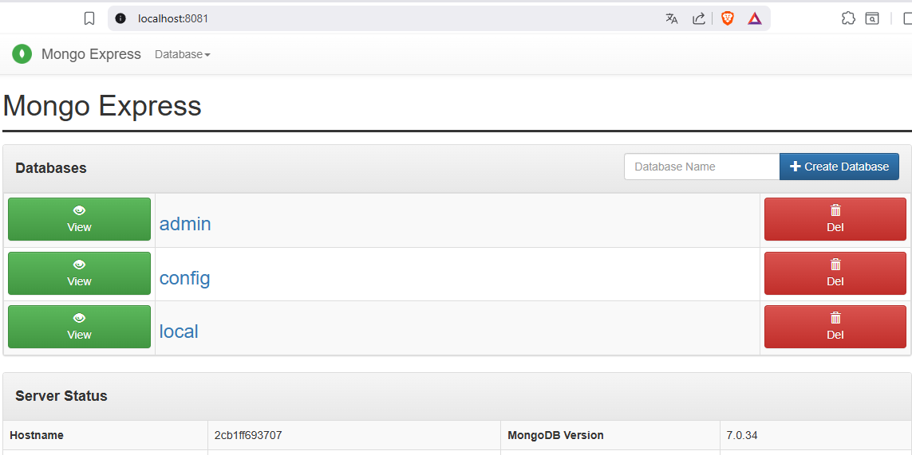

# Práctica A5 P1.5 - BOTIGA-DOCKER-MONGODB

## Preguntas de la práctica

### Bloque 1

#### 1. ¿Cuál es la diferencia entre `docker run` y `docker compose up`?

La diferencia principal entre `docker run` y `docker compose up` radica en su propósito y funcionalidad. `docker run` se utiliza para ejecutar un contenedor individualmente, mientras que `docker compose up` se emplea para iniciar y gestionar múltiples contenedores definidos en un archivo `docker-compose.yml`, facilitando la orquestación de aplicaciones complejas con múltiples servicios.

#### 2. ¿Para qué sirve la instrucción `depends_on`? ¿Garantiza que el servicio dependiente esté completamente operativo?

La instrucción `depends_on` en Docker Compose se utiliza para definir dependencias entre servicios, indicando que un servicio debe iniciarse antes que otro. Sin embargo, `depends_on` **no garantiza** que el servicio dependiente esté completamente operativo; solo asegura que el contenedor se haya iniciado. Para garantizar la operatividad completa, es necesario implementar mecanismos adicionales, como scripts de espera o health checks.

#### 3. ¿Cuál es la diferencia entre una red bridge por defecto y una red personalizada (con nombre) en Docker Compose?

La red bridge por defecto es creada automáticamente por Docker para cada contenedor, lo que puede llevar a conflictos de nombres y dificultades para gestionar la comunicación entre contenedores. En cambio, una red personalizada con nombre permite definir un espacio de nombres específico, facilitando la comunicación entre contenedores y proporcionando un mayor control sobre la configuración de la red, como la asignación de subredes y gateways.

---

### Bloque 2

#### 2.2 Prueba de persistencia

Demuestra que los volúmenes funcionan correctamente siguiendo estos pasos y documenta cada paso con una captura de pantalla:

**1. Comprobamos que la base de datos existe**


**2. Tras reiniciar el container con `docker compose down` y `docker compose up -d`**


Se comprueba que la base de datos sigue existiendo tras el reinicio del contenedor, lo que confirma que los datos se han persistido correctamente gracias a los volúmenes definidos en el `docker-compose.yml`.

#### 2.3 Preguntas teóricas

##### 1. ¿Qué pasaría si no definiésemos ningún volumen en el docker-compose.yml? Haz la prueba y documenta el resultado.

Si no definimos ningún volumen en el `docker-compose.yml`, los datos generados se almacenarán dentro del sistema de archivos del contenedor. Esto significa que si el contenedor se detiene o se elimina, todos los datos se perderán.

**Prueba realizada:**

1. Se eliminaron las líneas de volúmenes del `docker-compose.yml`:
   ```yaml
   volumes:
     - ./data:/data/db
     - ./mongo-init:/docker-entrypoint-initdb.d
   ```

2. Se recreó el contenedor y se creó una base de datos llamada "prueba".


3. Se ejecutó `docker compose down` y `docker compose up -d`.

4. Se comprobó que la base de datos "prueba" ya no existía.



**Conclusión:** Sin volúmenes, los datos no persisten entre reinicios de contenedores.

##### 2. Explica la diferencia entre un volumen y un bind mount. ¿Cuál es la mejor opción para cada caso?

Un **volumen** en Docker es un área de almacenamiento gestionada por Docker que se utiliza para persistir datos generados y utilizados por los contenedores. Los volúmenes son independientes del ciclo de vida de los contenedores, lo que significa que los datos almacenados en un volumen no se eliminan cuando el contenedor se detiene o se elimina.

Por otro lado, un **bind mount** es una forma de montar un directorio del host directamente en el contenedor. Esto permite que los cambios realizados en el directorio del host se reflejen inmediatamente en el contenedor y viceversa.

**¿Cuál es la mejor opción para cada caso?**

| Tipo | Mejor opción para... |
|------|---------------------|
| **Volumen** | Datos que necesitan persistir más allá del ciclo de vida del contenedor (bases de datos, archivos de aplicación) |
| **Bind mount** | Desarrollo y pruebas donde se requiere acceso directo a los archivos del host para edición en tiempo real |

##### 3. Explica la diferencia entre la estrategia embedding y la estrategia referencia con ejemplos. Los ejemplos deben ser diferentes a los expuestos en este documento.

La **estrategia de embedding** en MongoDB implica almacenar documentos relacionados dentro de un mismo documento, lo que permite acceder a toda la información relacionada en una sola consulta.

**Ejemplo de embedding: Colección "pedidos" con productos incrustados**

```json
{
  "_id": ObjectId("..."),
  "fecha": "2024-01-15",
  "cliente": "Juan Pérez",
  "productos": [
    {
      "nombre": "Ratón USB",
      "cantidad": 2,
      "precio": 15.99
    },
    {
      "nombre": "Teclado mecánico",
      "cantidad": 1,
      "precio": 89.99
    }
  ],
  "total": 121.97
}
```

La **estrategia de referencia** implica almacenar documentos relacionados en colecciones separadas y utilizar referencias (como ObjectId) para vincularlos.

**Ejemplo de referencia: Colecciones separadas "pedidos" y "productos"**

Colección "pedidos":
```json
{
  "_id": ObjectId("..."),
  "fecha": "2024-01-15",
  "cliente": "Juan Pérez",
  "productos_ids": [
    ObjectId("..."),
    ObjectId("...")
  ],
  "total": 121.97
}
```

Colección "productos":
```json
{
  "_id": ObjectId("..."),
  "nombre": "Ratón USB",
  "precio": 15.99,
  "stock": 50
}
```

**¿Cuándo usar cada una?**

| Estrategia | Ventajas | Desventajas |
|------------|----------|-------------|
| **Embedding** | Una sola consulta, mejor rendimiento | Datos duplicados, tamaño limitado (16MB) |
| **Referencia** | Normalización, sin duplicación | Múltiples consultas, más complejidad |

##### 4. Explica qué estrategia o estrategias has utilizado en la colección pedidos y por qué.

En la colección **comandes** se ha utilizado una **combinación de ambas estrategias**:

| Parte del pedido | Estrategia | Justificación |
|-----------------|------------|----------------|
| Productos del pedido | **Embedding** | Mantener un snapshot del precio en el momento de la compra |
| Cliente asociado | **Referencia** (`client_id`) | Evitar duplicar datos del cliente y facilitar actualizaciones |

Esta combinación permite:
- ✅ Consultar un pedido completo en una sola consulta
- ✅ Mantener el precio congelado en el momento de la compra
- ✅ Actualizar los datos del cliente centralizadamente sin afectar pedidos históricos

---

### Bloque 3

#### Pregunta 1: ¿El nombre del producto es único? Justifica la respuesta.

**No**, el nombre del producto no es único en la colección.

**Justificación:** En el diseño de la colección `productes`, no se ha definido un índice único sobre el campo `nom`. Solo se ha creado un índice normal para optimizar las búsquedas por nombre:

```javascript
db.productes.createIndex({ nom: 1 });
```

En un entorno real de comercio electrónico es posible encontrar productos de diferentes proveedores con el mismo nombre, por lo que no se recomienda imponer la unicidad a menos que sea un requisito estricto del negocio.

#### Pregunta 2: ¿Qué significa el término "proyectar" en las consultas? Explícalo con un ejemplo diferente al del enunciado.

**Proyectar** significa seleccionar qué campos se desean mostrar en el resultado de una consulta, excluyendo aquellos que no son necesarios.

**Ejemplo diferente:** Supongamos una colección `empleados` con los campos: `nombre`, `email`, `salario`, `departamento`.

Consulta con proyección (solo nombre y email):
```javascript
db.empleados.find(
  { departamento: "Ventas" },
  { projection: { nombre: 1, email: 1, _id: 0 } }
)
```

**Ventajas:** Mejor rendimiento, mayor seguridad y respuestas más claras.

#### Pregunta 3: Lista todas las funciones y operadores que has utilizado en las consultas, explica su significado y describe un ejemplo de uso diferente.

**Funciones utilizadas:**

| Función | Significado | Ejemplo diferente |
|---------|-------------|-------------------|
| `insertOne()` | Inserta un único documento | `db.libros.insertOne({ titulo: "Cien años" })` |
| `insertMany()` | Inserta múltiples documentos | `db.libros.insertMany([{ titulo: "Libro 1" }])` |
| `find()` | Busca documentos | `db.libros.find({ autor: "García Márquez" })` |
| `updateOne()` | Actualiza un documento | `db.libros.updateOne({ titulo: "Cien años" }, { $set: { anio: 1967 } })` |
| `updateMany()` | Actualiza múltiples documentos | `db.libros.updateMany({}, { $inc: { ventas: 1 } })` |
| `deleteOne()` | Elimina un documento | `db.libros.deleteOne({ titulo: "Libro antiguo" })` |
| `deleteMany()` | Elimina múltiples documentos | `db.libros.deleteMany({ anio: { $lt: 1900 } })` |
| `countDocuments()` | Cuenta documentos | `db.libros.countDocuments({ autor: "Cervantes" })` |
| `distinct()` | Devuelve valores únicos de un campo | `db.libros.distinct("autor")` |

**Operadores de comparación:**

| Operador | Significado | Ejemplo diferente |
|----------|-------------|-------------------|
| `$lt` | Menor que | `db.libros.find({ precio: { $lt: 15 } })` |
| `$gt` | Mayor que | `db.libros.find({ paginas: { $gt: 500 } })` |
| `$gte` | Mayor o igual que | `db.libros.find({ valoracion: { $gte: 4.5 } })` |

**Operadores de actualización:**

| Operador | Significado | Ejemplo diferente |
|----------|-------------|-------------------|
| `$set` | Establece el valor de un campo | `db.libros.updateOne({}, { $set: { idioma: "Español" } })` |
| `$inc` | Incrementa un valor numérico | `db.libros.updateMany({}, { $inc: { stock: -1 } })` |
| `$addToSet` | Añade elemento a un array | `db.libros.updateOne({}, { $addToSet: { etiquetas: "clásico" } })` |

---

### Bloque 4

#### Pregunta 1: ¿Cuándo puede ser perjudicial tener demasiados índices en una colección? Explica el compromiso (trade-off) entre lectura y escritura.

Tener demasiados índices puede ser perjudicial porque:

- **Ralentiza las operaciones de escritura** (`insert`, `update`, `delete`), ya que cada índice debe actualizarse cuando se modifica un documento.
- **Ocupa más espacio en disco y memoria RAM.**
- **Puede confundir al optimizador de consultas** de MongoDB.

**Trade-off (compromiso):**

| Operación | Sin índices | Con índices óptimos | Con demasiados índices |
|-----------|-------------|---------------------|------------------------|
| **Lectura (find)** | Muy lenta | Muy rápida | Rápida |
| **Escritura (insert/update/delete)** | Rápida | Moderada | Lenta |
| **Espacio en disco** | Poco | Moderado | Mucho |

**Recomendación:** Crear solo los índices necesarios para las consultas más frecuentes y monitorizar su uso.

#### Pregunta 2: Lista todas las funciones y operadores que has utilizado en las consultas avanzadas, explica su significado y describe un ejemplo de uso diferente.

**Operadores de consulta avanzada:**

| Operador | Significado | Ejemplo diferente |
|----------|-------------|-------------------|
| `$and` | Todas las condiciones deben cumplirse | `db.productos.find({ $and: [{ precio: { $gt: 10 } }, { precio: { $lt: 50 } }] })` |
| `$or` | Al menos una condición debe cumplirse | `db.productos.find({ $or: [{ categoria: "libros" }, { valoracion: { $gte: 4 } }] })` |
| `$regex` | Búsqueda por patrón de texto | `db.productos.find({ nombre: { $regex: /oferta/i } })` |
| `$text` | Búsqueda full-text | `db.productos.find({ $text: { $search: "smartphone" } })` |

**Operadores de agregación:**

| Operador | Significado | Ejemplo diferente |
|----------|-------------|-------------------|
| `$group` | Agrupa documentos | `{ $group: { _id: "$categoria", total: { $sum: 1 } } }` |
| `$sum` | Suma valores | `{ $sum: "$precio" }` |
| `$avg` | Calcula el promedio | `{ $avg: "$precio" }` |
| `$sort` | Ordena resultados | `{ $sort: { precio: -1 } }` |
| `$limit` | Limita resultados | `{ $limit: 5 }` |

**Métodos de ordenación y límite:**

| Método | Significado | Ejemplo diferente |
|--------|-------------|-------------------|
| `sort()` | Ordena los resultados | `db.productos.find().sort({ precio: 1 })` |
| `limit()` | Limita el número de resultados | `db.productos.find().limit(10)` |

**Gestión de índices:**

| Método | Significado | Ejemplo diferente |
|--------|-------------|-------------------|
| `createIndex()` | Crea un índice | `db.productos.createIndex({ stock: -1 })` |
| `getIndexes()` | Lista todos los índices | `db.productos.getIndexes()` |
| `dropIndex()` | Elimina un índice | `db.productos.dropIndex("precio_1")` |
| `explain()` | Muestra estadísticas de ejecución | `db.productos.find({ precio: { $gt: 50 } }).explain("executionStats")` |

---

## Ejecución de scripts

### Script CRUD (queries/crud.js)

```bash
docker exec -it mongodb-botiga mongosh -u admin -p admin123 --authenticationDatabase admin --file /queries/crud.js
```

*[Aquí puedes añadir capturas de la salida del script]*

### Script Advanced (queries/advanced.js)

```bash
docker exec -it mongodb-botiga mongosh -u admin -p admin123 --authenticationDatabase admin --file /queries/advanced.js
```

*[Aquí puedes añadir capturas de la salida del script]*

---
