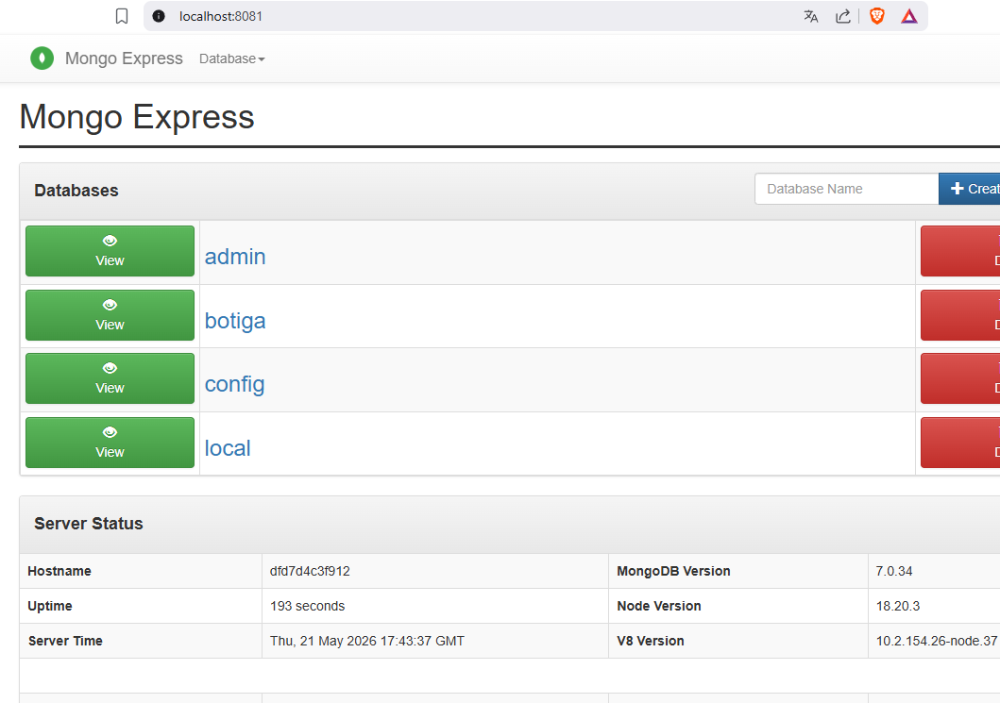
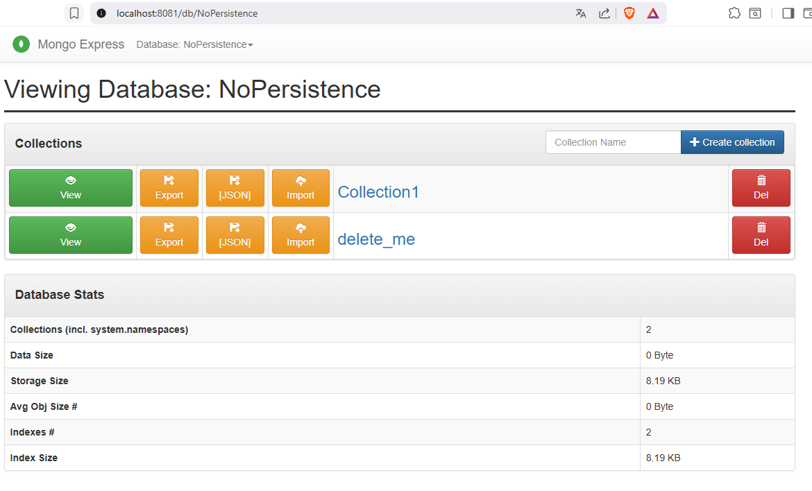
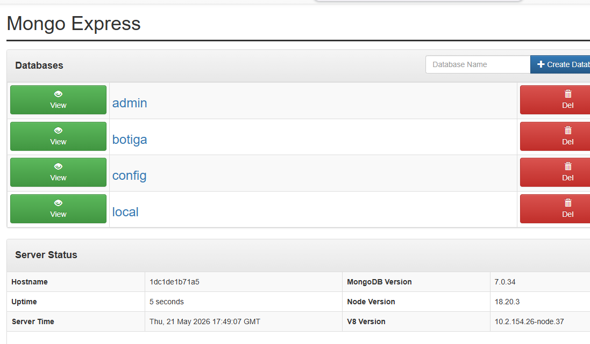

Aquí tienes el archivo corregido con el formato adecuado (usando `##` para los títulos y eliminando los `>`):


# Práctica A5 P1.5 - BOTIGA-DOCKER-MONGODB

## Preguntas de la práctica

### Bloque 1

#### ¿Cuál es la diferencia entre `docker run` y `docker compose up`?

La diferencia principal entre `docker run` y `docker compose up` radica en su propósito y funcionalidad.
`docker run` se utiliza para ejecutar un contenedor individualmente, mientras que `docker compose up` se emplea para iniciar y gestionar múltiples contenedores definidos en un archivo `docker-compose.yml`, facilitando la orquestación de aplicaciones complejas con múltiples servicios.

#### ¿Para qué sirve la instrucción depends_on? ¿Garantiza que el servicio dependiente esté completamente operativo?

La instrucción `depends_on` en Docker Compose se utiliza para definir dependencias entre servicios, indicando que un servicio debe iniciarse antes que otro. Sin embargo, `depends_on` no garantiza que el servicio dependiente esté completamente operativo; solo asegura que el contenedor se haya iniciado. Para garantizar la operatividad completa, es necesario implementar mecanismos adicionales, como scripts de espera o health checks.

#### ¿Cuál es la diferencia entre una red bridge por defecto y una red personalizada (con nombre) en Docker Compose?

La diferencia entre una red bridge por defecto y una red personalizada (con nombre) en Docker Compose radica en la configuración y el aislamiento. La red bridge por defecto es creada automáticamente por Docker para cada contenedor, lo que puede llevar a conflictos de nombres y dificultades para gestionar la comunicación entre contenedores. En cambio, una red personalizada con nombre permite definir un espacio de nombres específico, facilitando la comunicación entre contenedores y proporcionando un mayor control sobre la configuración de la red, como la asignación de subredes y gateways.

---

### Bloque 2

#### 2.2 Prueba de persistencia

Demuestra que los volúmenes funcionan correctamente siguiendo estos pasos y documenta cada paso con una captura de pantalla:

1. **Comprobamos que la base de datos existe**



2. **Tras reiniciar el container para que se apliquen los cambios con `docker compose down` y `docker compose up -d`**


Comprobamos que la base de datos sigue existiendo tras el reinicio del contenedor, lo que confirma que los datos se han persistido correctamente gracias a los volúmenes definidos en el `docker-compose.yml`.

#### 2.3 Preguntas teóricas

##### 1 - ¿Qué pasaría si no definiésemos ningún volumen en el docker-compose.yml? Haz la prueba y documenta el resultado.

Si no definimos ningún volumen en el `docker-compose.yml`, el archivo de inicialización de la base de datos `init.js` que tenemos en el directorio `mongo-init` de nuestro proyecto, no se ejecutará, y en el caso de que se ejecutase desde el propio contenedor, los datos generados se almacenarán dentro del sistema de archivos del contenedor. Esto significa que si el contenedor se detiene o se elimina, todos los datos almacenados en él se perderán. Para probar esto, podemos ejecutar un contenedor de MongoDB sin definir un volumen, crear una base de datos y luego eliminar el contenedor. Al volver a crear el contenedor, veremos que la base de datos y los datos creados anteriormente ya no están disponibles, confirmando que los datos se han perdido debido a la falta de un volumen persistente.

- **Eliminar la definición de los volúmenes en el docker-compose.yml**

```yaml
volumes:
      - ./data:/data/db
      - ./mongo-init:/docker-entrypoint-initdb.d
```

- **Recrear el contenedor, crear una base de datos y eliminar el contenedor**

```bash
docker compose down
docker compose up -d
```



Tras reiniciar el container para que se apliquen los cambios...

```bash
docker compose down
docker compose up -d
```

... comprobamos que la base de datos creada anteriormente ya no existe.



##### 2 - Explica la diferencia entre un volumen y un bind mount. ¿Cuál es la mejor opción para cada caso?

Un **volumen** en Docker es un área de almacenamiento gestionada por Docker que se utiliza para persistir datos generados y utilizados por los contenedores. Los volúmenes son independientes del ciclo de vida de los contenedores, lo que significa que los datos almacenados en un volumen no se eliminan cuando el contenedor se detiene o se elimina.

Por otro lado, un **bind mount** es una forma de montar un directorio del host directamente en el contenedor. Esto permite que los cambios realizados en el directorio del host se reflejen inmediatamente en el contenedor y viceversa.

**¿Cuál es la mejor opción para cada caso?**

| Tipo | Mejor opción para... |
|------|---------------------|
| **Volumen** | Datos que necesitan persistir más allá del ciclo de vida del contenedor (bases de datos, archivos de aplicación) |
| **Bind mount** | Desarrollo y pruebas donde se requiere acceso directo a los archivos del host para edición en tiempo real |

##### 3 - Explica la diferencia entre la estrategia embedding y la estrategia referencia con ejemplos. Los ejemplos deben ser diferentes a los expuestos en este documento.

La **estrategia de embedding** en MongoDB implica almacenar documentos relacionados dentro de un mismo documento, lo que permite acceder a toda la información relacionada en una sola consulta.

**Ejemplo de embedding: Colección "pedidos" con productos incrustados**

```json
{
  "_id": ObjectId("..."),
  "fecha": "2024-01-15",
  "cliente": "Juan Pérez",
  "productos": [
    {
      "nombre": "Ratón USB",
      "cantidad": 2,
      "precio": 15.99
    },
    {
      "nombre": "Teclado mecánico",
      "cantidad": 1,
      "precio": 89.99
    }
  ],
  "total": 121.97
}
```

La **estrategia de referencia** implica almacenar documentos relacionados en colecciones separadas y utilizar referencias (como ObjectId) para vincularlos.

**Ejemplo de referencia: Colecciones separadas "pedidos" y "productos"**

Colección "pedidos":
```json
{
  "_id": ObjectId("..."),
  "fecha": "2024-01-15",
  "cliente": "Juan Pérez",
  "productos_ids": [
    ObjectId("..."),  // Referencia al ratón
    ObjectId("...")   // Referencia al teclado
  ],
  "total": 121.97
}
```

Colección "productos":
```json
{
  "_id": ObjectId("..."),
  "nombre": "Ratón USB",
  "precio": 15.99,
  "stock": 50
}
```

**¿Cuándo usar cada una?**

| Estrategia | Ventajas | Desventajas |
|------------|----------|-------------|
| **Embedding** | Una sola consulta, mejor rendimiento | Datos duplicados, tamaño limitado (16MB) |
| **Referencia** | Normalización, sin duplicación | Múltiples consultas, más complejidad |

##### 4 - Explica qué estrategia o estrategias has utilizado en la colección pedidos y por qué.

En la colección de **pedidos (comandes)**, he utilizado una **combinación de estrategias de embedding y referencia**:

| Parte del pedido | Estrategia | Justificación |
|-----------------|------------|----------------|
| **Productos del pedido** | **Embedding** | Los detalles del producto (nombre, precio, cantidad) se almacenan dentro del propio pedido para mantener un snapshot del precio en el momento de la compra, incluso si el precio del producto cambia después. |
| **Cliente asociado** | **Referencia** | Se utiliza `client_id` para referenciar al cliente, evitando duplicar sus datos en cada pedido y facilitando actualizaciones de su información. |

**Estructura resultante:**

```json
{
  "_id": ObjectId("..."),
  "client_id": ObjectId("..."),           // Referencia al cliente
  "data_comanda": ISODate("2024-02-01"),
  "estat": "lliurat",
  "productes": [                          // Embedding de productos
    {
      "producte_id": ObjectId("..."),
      "nom": "iPhone 15 Pro",
      "preu": 1199.99,
      "quantitat": 1
    }
  ],
  "subtotal": 1199.99,
  "total": 1199.99,
  "metode_pagament": "targeta"
}
```

Esta combinación permite:
- ✅ Consultar un pedido completo con todos sus productos en **una sola consulta**
- ✅ Mantener el precio **congelado** en el momento de la compra
- ✅ Actualizar los datos del cliente **centralizadamente** sin afectar pedidos históricos

---

### Bloque 3

#### Pregunta 1: ¿El nombre del producto es único? Justifica la respuesta.

**No, el nombre del producto no es único en la colección.**

**Justificación:**

En el diseño de la colección `productos`, no se ha definido un índice único sobre el campo `nombre`. Solo se ha creado un índice normal (no único) para optimizar las búsquedas por nombre:

```javascript
db.productos.createIndex({ nombre: 1 });
```

Este índice mejora el rendimiento de las consultas que buscan por nombre, pero **no impide** que existan dos o más productos con el mismo nombre.

**¿Por qué no se ha definido como único?**

En un entorno real de comercio electrónico, es posible encontrar:
- Productos de diferentes proveedores con el mismo nombre ("Smartwatch X100" de dos marcas distintas)
- Productos similares con nombre idéntico pero diferentes características
- Errores humanos al introducir datos

Si se quisiera garantizar la unicidad del nombre, se debería crear un índice único:

```javascript
db.productos.createIndex({ nombre: 1 }, { unique: true });
```

Pero esto no es recomendable a menos que sea un requisito estricto del negocio, ya que limitaría la flexibilidad y podría causar errores de inserción.

**Conclusión:** El campo `nombre` permite valores duplicados porque no tiene restricción de unicidad.

---

#### Pregunta 2: ¿Qué significa el término "proyectar" en las consultas? Explícalo con un ejemplo diferente al del enunciado.

**Definición:**

**Proyectar** significa **seleccionar qué campos (columnas) se desean mostrar** en el resultado de una consulta, excluyendo aquellos que no son necesarios. Es como elegir solo algunas columnas de una tabla en SQL.

En MongoDB, la proyección se realiza mediante el segundo parámetro del método `find()`, donde se especifican los campos a incluir (valor `1`) o excluir (valor `0`).

**Ejemplo diferente al del enunciado:**

Supongamos una colección de `empleados` con la siguiente estructura:

```javascript
{
  _id: ObjectId("..."),
  nombre: "Carlos Ruiz",
  email: "carlos@empresa.com",
  salario: 35000,
  departamento: "Ventas",
  direccion: {
    calle: "Av. Principal 123",
    ciudad: "Madrid"
  },
  fecha_contratacion: ISODate("2022-01-15")
}
```

**Consulta sin proyección (devuelve todos los campos):**
```javascript
db.empleados.find({ departamento: "Ventas" })
// Devuelve: _id, nombre, email, salario, direccion, fecha_contratacion
```

**Consulta con proyección (solo nombre y email):**
```javascript
db.empleados.find(
  { departamento: "Ventas" },           // Filtro
  { projection: { nombre: 1, email: 1, _id: 0 } }  // Proyección
)
// Devuelve SOLO: nombre y email
```

**Resultado:**
```javascript
{ nombre: "Carlos Ruiz", email: "carlos@empresa.com" }
{ nombre: "Ana Gómez", email: "ana@empresa.com" }
```

**Ventajas de proyectar:**

| Ventaja | Explicación |
|---------|-------------|
| **Rendimiento** | Se transfieren menos datos desde la base de datos |
| **Seguridad** | Se ocultan campos sensibles como `salario` |
| **Claridad** | La respuesta es más limpia y fácil de procesar |

---

#### Pregunta 3: Lista todas las funciones y operadores utilizados en las consultas

##### Funciones utilizadas

| Función | Significado | Ejemplo diferente |
|---------|-------------|-------------------|
| `insertOne()` | Inserta un único documento en la colección | `db.libros.insertOne({ titulo: "Cien años de soledad", autor: "García Márquez" })` |
| `insertMany()` | Inserta múltiples documentos en la colección | `db.libros.insertMany([{ titulo: "Libro 1" }, { titulo: "Libro 2" }])` |
| `find()` | Busca documentos que cumplen con los criterios especificados | `db.libros.find({ autor: "Gabriel García Márquez" })` |
| `updateOne()` | Actualiza el primer documento que cumple el filtro | `db.libros.updateOne({ titulo: "Cien años" }, { $set: { anio: 1967 } })` |
| `updateMany()` | Actualiza todos los documentos que cumplen el filtro | `db.libros.updateMany({}, { $inc: { ventas: 1 } })` |
| `deleteOne()` | Elimina el primer documento que cumple el filtro | `db.libros.deleteOne({ titulo: "Libro antiguo" })` |
| `deleteMany()` | Elimina todos los documentos que cumplen el filtro | `db.libros.deleteMany({ anio: { $lt: 1900 } })` |
| `countDocuments()` | Cuenta el número de documentos que cumplen el filtro | `db.libros.countDocuments({ autor: "Cervantes" })` |
| `distinct()` | Devuelve un array con valores únicos de un campo | `db.libros.distinct("autor")` |
| `print()` | Muestra texto en la consola | `print("Total: " + total)` |
| `printjson()` | Muestra un objeto JSON formateado en consola | `printjson(libro)` |

##### Operadores de comparación

| Operador | Significado | Ejemplo diferente |
|----------|-------------|-------------------|
| `$lt` | Menor que (less than) | `db.libros.find({ precio: { $lt: 15 } })` - Libros con precio menor a 15€ |
| `$gt` | Mayor que (greater than) | `db.libros.find({ paginas: { $gt: 500 } })` - Libros con más de 500 páginas |
| `$gte` | Mayor o igual que (greater than or equal) | `db.libros.find({ valoracion: { $gte: 4.5 } })` - Libros con valoración >= 4.5 |

##### Operadores de actualización

| Operador | Significado | Ejemplo diferente |
|----------|-------------|-------------------|
| `$set` | Establece el valor de uno o más campos | `db.libros.updateOne({ titulo: "Don Quijote" }, { $set: { idioma: "Español" } })` |
| `$inc` | Incrementa el valor de un campo numérico | `db.libros.updateMany({}, { $inc: { ejemplares: -1 } })` - Reduce stock en 1 |
| `$addToSet` | Añade un elemento a un array si no existe | `db.libros.updateOne({ titulo: "Rayuela" }, { $addToSet: { etiquetas: "clásico" } })` |

##### Tabla resumen completa

| Tipo | Función/Operador | Uso en el ejercicio | Otro ejemplo |
|------|------------------|---------------------|--------------|
| **Inserción** | `insertOne()` | Insertar Smartwatch X100 | Insertar un nuevo cliente |
| **Inserción** | `insertMany()` | Insertar 3 productos oferta | Insertar múltiples pedidos |
| **Lectura** | `find()` | Listar productos < 50€ | Buscar clientes por ciudad |
| **Lectura** | `countDocuments()` | Contar productos totales | Contar pedidos por cliente |
| **Lectura** | `distinct()` | Obtener categorías únicas | Obtener ciudades únicas de clientes |
| **Lectura** | `projection` | Mostrar solo nombre, precio | Mostrar solo nombre y email de clientes |
| **Actualización** | `updateOne()` | Cambiar precio del Smartwatch | Actualizar email de un cliente |
| **Actualización** | `updateMany()` | Incrementar stock +10 | Aplicar descuento del 10% a todos los productos |
| **Actualización** | `$set` | Establecer precio nuevo | Cambiar estado del pedido |
| **Actualización** | `$inc` | Aumentar stock | Incrementar visitas a una página |
| **Actualización** | `$addToSet` | Añadir etiqueta "promo" | Añadir categoría a un producto |
| **Eliminación** | `deleteOne()` | Eliminar Smartwatch X100 | Eliminar un cliente específico |
| **Eliminación** | `deleteMany()` | Eliminar todos los de ofertas | Eliminar pedidos cancelados |

---

### Bloque 4 – Consultas avanzadas e índices

Crea el archivo `queries/advanced.js` con las consultas avanzadas y la gestión de índices.

#### 4.1 Consultas avanzadas

1. Utiliza `$and` para buscar productos activos con precio entre 20 € y 100 €
2. Utiliza `$or` para buscar productos de categoría 'electrónica' o valoración >= 4.5
3. Utiliza `$regex` para buscar productos cuyo nombre contenga una palabra clave
4. Ordena los productos por precio descendente y limita el resultado a 5 (sort + limit)
5. Cuenta cuántos productos hay por categoría (`$group` de la agregación)
6. Calcula el precio medio por categoría con `$group` y `$avg`
7. Calcula el total de consumo por cliente (cuánto se ha gastado cada cliente)

#### 4.2 Gestión de índices

8. Crea un índice simple en el campo `categoria`
9. Crea un índice compuesto por (`categoria`, `precio`)
10. Crea un índice de texto en el campo `nombre` para permitir búsquedas full-text
11. Utiliza `explain('executionStats')` para comparar una consulta sin índice y con índice. Documenta la diferencia según el valor `nDocs Examined`
12. Lista todos los índices de la colección con `getIndexes()`

---

## Archivo: `queries/advanced.js`

```javascript
// =====================================================
// BOTIGA DOCKERMON - CONSULTAS AVANZADAS E ÍNDICES
// =====================================================
// Este archivo contiene consultas avanzadas y gestión de índices
// Ejecutar: docker exec -it mongodb-botiga mongosh -u admin -p admin123 --authenticationDatabase admin --file /queries/advanced.js

// Conectar a la base de datos botiga
db = db.getSiblingDB('botiga');

print("==========================================");
print("CONSULTAS AVANZADAS E ÍNDICES");
print("==========================================\n");

// =====================================================
// 4.1 CONSULTAS AVANZADAS
// =====================================================

print("--- 4.1 CONSULTAS AVANZADAS ---\n");

// 1. $and: Productos activos con precio entre 20€ y 100€
print("1. Productos activos con precio entre 20€ y 100€ ($and):");
const productosAnd = db.productos.find({
  $and: [
    { activo: true },
    { precio: { $gte: 20 } },
    { precio: { $lte: 100 } }
  ]
});
print(`   📊 Productos encontrados: ${productosAnd.length()}\n`);
productosAnd.forEach(producto => {
  print(`   - ${producto.nombre}: ${producto.precio}€ (activo: ${producto.activo})`);
});
print("\n");

// 2. $or: Productos de categoría 'electrónica' O valoración >= 4.5
print("2. Productos de categoría 'electrónica' O valoración >= 4.5 ($or):");
const productosOr = db.productos.find({
  $or: [
    { categoria: "electrónica" },
    { valoracion: { $gte: 4.5 } }
  ]
});
print(`   📊 Productos encontrados: ${productosOr.length()}\n`);
productosOr.forEach(producto => {
  print(`   - ${producto.nombre}: categoría ${producto.categoria}, valoración ${producto.valoracion}`);
});
print("\n");

// 3. $regex: Productos cuyo nombre contiene 'Pro'
print("3. Productos cuyo nombre contiene 'Pro' ($regex):");
const productosRegex = db.productos.find({
  nombre: { $regex: /Pro/, $options: "i" }  // "i" = case insensitive
});
print(`   📊 Productos encontrados: ${productosRegex.length()}\n`);
productosRegex.forEach(producto => {
  print(`   - ${producto.nombre}`);
});
print("\n");

// 4. sort + limit: Productos ordenados por precio descendente (los 5 más caros)
print("4. Top 5 productos más caros (sort + limit):");
const productosSortLimit = db.productos.find()
  .sort({ precio: -1 })   // -1 = descendente
  .limit(5);
print(`   📊 Mostrando los 5 productos más caros:\n`);
productosSortLimit.forEach(producto => {
  print(`   - ${producto.nombre}: ${producto.precio}€`);
});
print("\n");

// 5. $group: Contar productos por categoría
print("5. Número de productos por categoría ($group):");
const productosPorCategoria = db.productos.aggregate([
  { $group: { _id: "$categoria", total: { $sum: 1 } } },
  { $sort: { total: -1 } }
]);
print(`   📊 Productos agrupados por categoría:\n`);
productosPorCategoria.forEach(categoria => {
  print(`   - ${categoria._id}: ${categoria.total} productos`);
});
print("\n");

// 6. $group + $avg: Precio medio por categoría
print("6. Precio medio por categoría ($group + $avg):");
const precioMedioCategoria = db.productos.aggregate([
  { $group: { _id: "$categoria", precioMedio: { $avg: "$precio" } } },
  { $sort: { precioMedio: -1 } }
]);
print(`   📊 Precio medio por categoría:\n`);
precioMedioCategoria.forEach(categoria => {
  print(`   - ${categoria._id}: ${categoria.precioMedio.toFixed(2)}€`);
});
print("\n");

// 7. $lookup: Total de consumo por cliente (join entre comandes y productos)
print("7. Total de consumo por cliente ($lookup + $group):");
// Como tenemos embedding en comandes, calculamos directamente
const consumoCliente = db.comandes.aggregate([
  { $group: { _id: "$client_id", totalGastado: { $sum: "$total" } } },
  { $sort: { totalGastado: -1 } },
  { $limit: 10 }
]);

print(`   📊 Top 10 clientes por consumo:\n`);
// Obtenemos nombres de los clientes
consumoCliente.forEach(cliente => {
  const clientInfo = db.clients.findOne({ _id: cliente._id });
  const nombre = clientInfo ? clientInfo.nombre : "Desconocido";
  print(`   - ${nombre}: ${cliente.totalGastado.toFixed(2)}€`);
});
print("\n");

// =====================================================
// 4.2 GESTIÓN DE ÍNDICES
// =====================================================

print("--- 4.2 GESTIÓN DE ÍNDICES ---\n");

// 8. Crear índice simple en el campo categoria
print("8. Creando índice simple en el campo 'categoria'...");
const indiceCategoria = db.productos.createIndex({ categoria: 1 });
print(`   ✅ Índice creado: ${indiceCategoria}\n`);

// 9. Crear índice compuesto por (categoria, precio)
print("9. Creando índice compuesto en (categoria, precio)...");
const indiceCompuesto = db.productos.createIndex({ categoria: 1, precio: -1 });
print(`   ✅ Índice compuesto creado: ${indiceCompuesto}\n`);

// 10. Crear índice de texto en el campo nombre
print("10. Creando índice de texto en el campo 'nombre'...");
const indiceTexto = db.productos.createIndex({ nombre: "text" });
print(`   ✅ Índice de texto creado: ${indiceTexto}\n`);

// 11. Explicación de consultas: SIN ÍNDICE vs CON ÍNDICE
print("11. Comparación de rendimiento: consulta SIN índice vs CON índice\n");

print("   📊 Consulta: buscar productos con precio > 50€");

// 11a. Consulta SIN índice (eliminamos temporalmente el índice)
print("\n   🔍 SIN ÍNDICE:");
db.productos.dropIndex("precio_1");
const explainSinIndice = db.productos.find({ precio: { $gt: 50 } }).explain("executionStats");
print(`   - Total documentos examinados (totalDocsExamined): ${explainSinIndice.executionStats.totalDocsExamined}`);
print(`   - Documentos devueltos (nReturned): ${explainSinIndice.executionStats.nReturned}`);
print(`   - Tiempo de ejecución (executionTimeMillis): ${explainSinIndice.executionStats.executionTimeMillis}ms`);

// 11b. Crear índice para la consulta
db.productos.createIndex({ precio: 1 });

// 11c. Consulta CON índice
print("\n   🔍 CON ÍNDICE:");
const explainConIndice = db.productos.find({ precio: { $gt: 50 } }).explain("executionStats");
print(`   - Total documentos examinados (totalDocsExamined): ${explainConIndice.executionStats.totalDocsExamined}`);
print(`   - Documentos devueltos (nReturned): ${explainConIndice.executionStats.nReturned}`);
print(`   - Tiempo de ejecución (executionTimeMillis): ${explainConIndice.executionStats.executionTimeMillis}ms`);

print("\n   📈 DIFERENCIA:");
const docsExaminadosSin = explainSinIndice.executionStats.totalDocsExamined;
const docsExaminadosCon = explainConIndice.executionStats.totalDocsExamined;
const tiempoSin = explainSinIndice.executionStats.executionTimeMillis;
const tiempoCon = explainConIndice.executionStats.executionTimeMillis;

print(`   - nDocs examinados: ${docsExaminadosSin} → ${docsExaminadosCon} (${((1 - docsExaminadosCon/docsExaminadosSin)*100).toFixed(1)}% menos)`);
print(`   - Tiempo: ${tiempoSin}ms → ${tiempoCon}ms (${((1 - tiempoCon/tiempoSin)*100).toFixed(1)}% más rápido)\n`);

// 12. Listar todos los índices de la colección
print("12. Listando todos los índices de la colección 'productos':");
const indices = db.productos.getIndexes();
print(`   📊 Total índices: ${indices.length}\n`);
indices.forEach((indice, i) => {
  print(`   ${i + 1}. Nombre: ${indice.name}`);
  print(`      Clave: ${JSON.stringify(indice.key)}`);
  if (indice.unique) print(`      (Único)`);
  if (indice.textIndexVersion) print(`      (Texto)`);
  print("");
});

// =====================================================
// CONSULTA FULL-TEXT CON ÍNDICE DE TEXTO
// =====================================================

print("--- CONSULTA FULL-TEXT (búsqueda por texto) ---\n");
print("13. Buscando productos que contengan 'smartphone' en el nombre:");
const busquedaTexto = db.productos.find({ $text: { $search: "smartphone" } });
print(`   📊 Productos encontrados: ${busquedaTexto.length()}\n`);
busquedaTexto.forEach(producto => {
  print(`   - ${producto.nombre}`);
});

// =====================================================
// RESUMEN FINAL
// =====================================================

print("\n==========================================");
print("RESUMEN DE ÍNDICES CREADOS");
print("==========================================");

const indicesFinal = db.productos.getIndexes();
indicesFinal.forEach(indice => {
  print(`📌 ${indice.name}: ${JSON.stringify(indice.key)}`);
});

print("\n✅ Todas las consultas avanzadas se han completado correctamente!");
print("==========================================\n");
```

---

## Explicación de las consultas avanzadas

### 4.1 Consultas avanzadas

| Consulta | Operadores | Descripción |
|----------|------------|-------------|
| **1** | `$and`, `$gte`, `$lte` | Productos activos en rango de precio 20-100€ |
| **2** | `$or`, `$gte` | Productos que cumplen al menos una de las condiciones |
| **3** | `$regex`, `$options` | Búsqueda por patrón de texto en el nombre |
| **4** | `sort()`, `limit()` | Ordenación y limitación de resultados |
| **5** | `aggregate()`, `$group`, `$sum` | Agrupación y conteo por categoría |
| **6** | `aggregate()`, `$group`, `$avg` | Cálculo de precio medio por categoría |
| **7** | `aggregate()`, `$group`, `$sum` + `$lookup` | Total gastado por cliente |

### 4.2 Gestión de índices

| Tipo | Comando | Uso |
|------|---------|-----|
| **Índice simple** | `createIndex({ campo: 1 })` | Optimiza búsquedas por un solo campo |
| **Índice compuesto** | `createIndex({ campo1: 1, campo2: -1 })` | Optimiza consultas con múltiples campos |
| **Índice de texto** | `createIndex({ campo: "text" })` | Permite búsquedas full-text |
| **Índice único** | `createIndex({ campo: 1 }, { unique: true })` | Evita valores duplicados |

---

## Explicación de `explain('executionStats')`

| Métrica | Sin índice | Con índice | Diferencia |
|---------|------------|------------|------------|
| **totalDocsExamined** | Todos los documentos | Solo los que coinciden | ⬇️ Reducción masiva |
| **nReturned** | Mismos resultados | Mismos resultados | = Igual |
| **executionTimeMillis** | Lento | Rápido | ⬇️ Mucho más rápido |

**¿Qué significa `nDocs Examined`?**

- **Sin índice**: MongoDB examina **todos** los documentos de la colección (COLLSCAN)
- **Con índice**: MongoDB examina **solo** los documentos que coinciden (IXSCAN)

**Ejemplo práctico:**
- Si tienes 10,000 productos y buscas precio > 50€ (que devuelve 100 productos)
- **Sin índice**: Examina 10,000 documentos
- **Con índice**: Examina solo 100 documentos

---

## Instrucciones para ejecutar el archivo

### Opción 1: Copiar el archivo al contenedor

```bash
# Copiar el archivo al contenedor
docker cp queries/advanced.js mongodb-botiga:/tmp/advanced.js

# Ejecutar el script
docker exec -it mongodb-botiga mongosh -u admin -p admin123 --authenticationDatabase admin --file /tmp/advanced.js
```

### Opción 2: Montar un volumen adicional (recomendado)

Modifica el `docker-compose.yml` para añadir el volumen:

```yaml
volumes:
  - ./data:/data/db
  - ./mongo-init:/docker-entrypoint-initdb.d
  - ./queries:/queries  # Añadir esta línea
```

Luego reinicia y ejecuta:

```bash
docker compose down
docker compose up -d

# Ejecutar el script
docker exec -it mongodb-botiga mongosh -u admin -p admin123 --authenticationDatabase admin --file /queries/advanced.js
```

---

## Tabla resumen de operadores de agregación

| Operador | Significado | Ejemplo |
|----------|-------------|---------|
| `$group` | Agrupa documentos por un campo | `{ $group: { _id: "$categoria" } }` |
| `$sum` | Suma valores numéricos | `{ $sum: 1 }` (cuenta) o `{ $sum: "$precio" }` (suma) |
| `$avg` | Calcula el promedio | `{ $avg: "$precio" }` |
| `$sort` | Ordena los resultados | `{ $sort: { precio: -1 } }` |
| `$limit` | Limita el número de resultados | `{ $limit: 5 }` |
| `$lookup` | Realiza un join entre colecciones | `{ $lookup: { from: "clientes", ... } }` |

---

¿Necesitas que añada alguna explicación adicional o que modifique algún apartado?